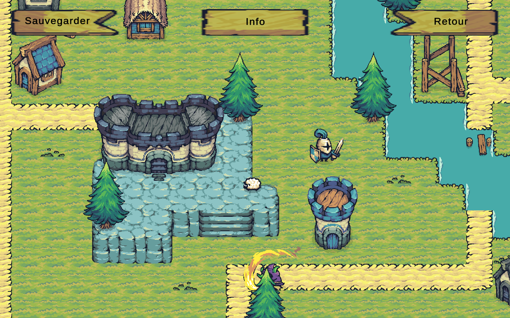

# uniquest 🧙‍♀️



School group project 🎓 — 3 contributors.
A 2D RPG adventure developed in Unity (C#) combining exploration, turn-based combat, and item management. It is not meant for commecial use, it is ony meant ot leanr how to use Unity without minding Assets creation and all.

---

### Features

- 🧭 Exploration: Tile-based movement and interactive maps.
- ⚔️ Turn-based combat system with enemy AI.
  -💊 Inventory & items system: potions, defense, flee, specialAttack.  
  -🎵 Dynamic music manager with looping playlist.
- 💾 Save system for player stats and progression.
- 🧩 Modular C# architecture separating entities, menu logic, and map interactions.

### Technologie

- 🎮 Unity 6.0.2f2
- 💻 C# scripting (MonoBehaviour)
- 🧱 2D Tilemap System
- 🎨 Custom sprites & prefabs
- 🔊 AudioSource / AudioClip for soundtrack and SFX
- 💾 JSON or PlayerPrefs save system

---

### Project Structure 📂

```
📦 UniQuest
 ┣ 📂 Assets
 ┃ ┣ 📂 Animated Tiles        # Animated objects and traps
 ┃ ┣ 📂 Building Tiles        # Tilemaps for environment and colliders
 ┃ ┣ 📂 Decoration Tiles      # Props and background details
 ┃ ┣ 📂 Effects               # Particles and visual effects
 ┃ ┣ 📂 Factions              # Enemy / NPC definitions
 ┃ ┣ 📂 Music                 # Game soundtrack (.mp3)
 ┃ ┣ 📂 Prefab                # Player, enemies, items prefabs
 ┃ ┣ 📂 Resources             # Fonts, icons, data
 ┃ ┣ 📂 Scenes                # MainMenu, Arena, WorldMap, etc.
 ┃ ┣ 📂 Scripts
 ┃ ┃ ┣ 📂 Entity              # Core classes: Entity, Player, Enemy, Health
 ┃ ┃ ┣ 📂 Fight               # Battle logic: ArenaManager, FightController
 ┃ ┃ ┣ 📂 Items               # Item classes: Potions, Bag, etc.
 ┃ ┃ ┣ 📂 Menu                # UI management (MainMenu, FightMenu, Stats)
 ┃ ┃ ┣ 📂 MusicScript         # AudioManager for background music
 ┃ ┃ ┣ 📂 Tilemap Script      # Map and trigger logic
 ┃ ┃ ┗ 📂 Utils               # Helper scripts (SaveSystem, PlayerData…)
 ┃ ┗ 📂 Sprites               # Character and environment sprites
 ┣ 📄 README.md
 ┗ 📄 ProjectSettings.asset

```

### Gameplay Overview 🎮

> **Main Menu** → Start, Continue, Quit  
> **Arena** → Turn-based fights against enemies  
> **Exploration** → Move through tile-based worlds  
> **Inventory** → Manage and use items or potions  
> **Save System** → Automatic player save and load

# Git workflow (for team)

Please never use `git add .` but add Assets/Scripts/ only instead making sure you won't add unecessary files to distant repository

```bash
git add Assets/Scripts
```

# Stack

- Unity 6.2 (6.000.2.6f1 from september 2025)
- C#

# Install

1. Download Unity Hub and create account on https://unity.com/download ( if you already have an account you can just login here https://unity.com/fr )
2. Make sure VS Code is installed on host (visual studio is not needed even if unity recommand it)
3. Install if needed `C# dev kit` extension
4. Create new project in Unity Hub `2D (Built-In Render Pipeline)` , project name `uniquest` location `browse your git repo location`
5. To link Unity Editor and VS code go in Unity Editor (needs to open project) : Edit > Preferences > External Tools > choose Visual Studio Code
   Make sure to check those items from `Generate .csproj files for`:

- Embedded packages ✅
- Local packages ✅
- Registry packages ✅
- Git packages ✅

If you had to check some boxes, click on `regenerate project files`.

# Assets

- We are using [Tiny Swords](https://pixelfrog-assets.itch.io/tiny-swords) asset pack from PixelFrog
- We downloaded the `TS_old version_CC0 Licensed` (jan 03, 2024).
- Creator of this pack is PixelFrog [PixelFrog instagram](https://www.instagram.com/pixelfrogstudio/) & [PixelFrog twitter](https://x.com/PixelFrogStudio)

6. All future script will be in Assets > Scripts

---

# Contributing This project was made by:

- [Thibault Caron](https://github.com/thibault-caron)
- [Adeline Patenne](https://github.com/AdelinePat/)
- [Florence Navet](https://github.com/florence-navet)

### Licence

This project is licensed under the MIT License.
